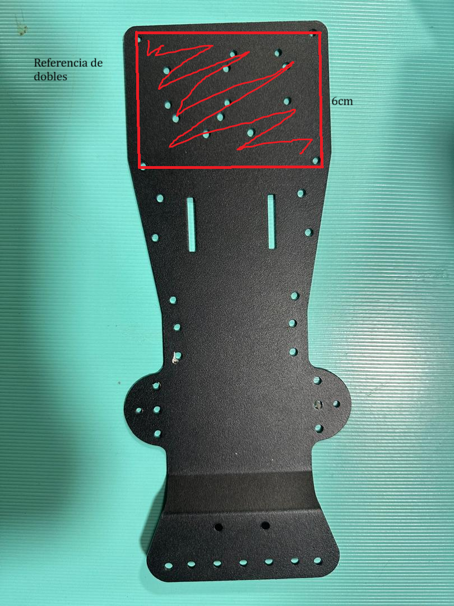

## Construcción Mecánica y Eléctrica
El proyecto Chola basa la estructura de su chasis en un Kit de carros autónomos adquirido a través de Alibaba: Encuéntralo aquí 
A pesar de ser un chasis adquirido, este fue sometido a algunas modificaciones con el fin de adaptarlo mejor a las necesidades y los lineamientos de la competencia. Es por ello que decidimos realizar un doblez a la platina principal del chasis en 90 grados hacia arriba:

El kit incluye otras piezas de plástico que fueron usadas de manera particular para este proyecto, específicamente las siguientes piezas:

Estas deberán unirse de la siguiente manera: Haciendo uso de resina epoxica mantenemos las piezas unidas de manera firme y resistente a impactos durante las pruebas de funcionamiento. También aprovechamos los agujeros para tornillos que tienen estas piezas para fijar nuestro microcontrolador principal:
[Insertar imagen del microcontrolador fijado aquí]

## Sistema de Dirección
El kit original venía con un sistema de dirección basado en un servomotor y algunas piezas para crear un sistema de dirección Ackerman. Este diseño fue una elección conveniente, no solo porque ya estaba incluido en el kit, sino también porque la configuración Ackerman es ideal para el propósito de la competencia. Permite que el vehículo tenga un sobreviraje controlado, lo que facilita giros más rápidos y eficientes, optimizando así el rendimiento en la competencia.

Aquí encontrará un tutorial del armado original del chasis:
https://youtu.be/ulTM1uV1Bvg?si=uPVaVt-tIMoJ6x8m

Imágenes de las piezas: 

Sin embargo, a pesar de las ventajas del sistema Ackerman, por motivos de precisión y durabilidad, decidimos realizar cambios a este sistema:
- Crear una placa de Baquelita de 2.5cm por 8.5cm.
- Utilizar un motor tipo stepper 28BYJ-48 de 5v.
- Utilizar una cobertura de motor circular.
- Perforar la cobertura para el motor.

## Medidas generales

Las ruedas traseras vienen incluidas en el kit , tienen unas medidas de 6cm de diámetro y 3cm de grosor 

Las ruedas delanteras son ruedas de para lego genéricas con medidas de 2.5cm de grosor y 4 cm de diámetro.

El eje trasero mide 8.5cm de longitud y el eje delantero mide 6.4cm con un volado delantero de 5cm.

La distancia entre ejes de 15.5 cm 

 - Las medidas totales de Chola con 21cm de largo y 8cm de ancho sin tomar en cuenta las ruedas , con estas el groso se eleva a 15 cm 
## Sistema de motor
El motor usado es un motor DC de 3v a 12v genérico , con un piñón de 12 dientes. 
Para transmitir el movimiento a las ruedas traseras , se engrana el motor a un piñón de 45 dientes , este último está ubicado en el eje de las ruedas y transmite el movimiento de los motores en una relación de 3,75

Lo cual todo esto nos deja una transmisión de 1500rpm a 375 rpm de el motor a el eje 
y un torque de ()
