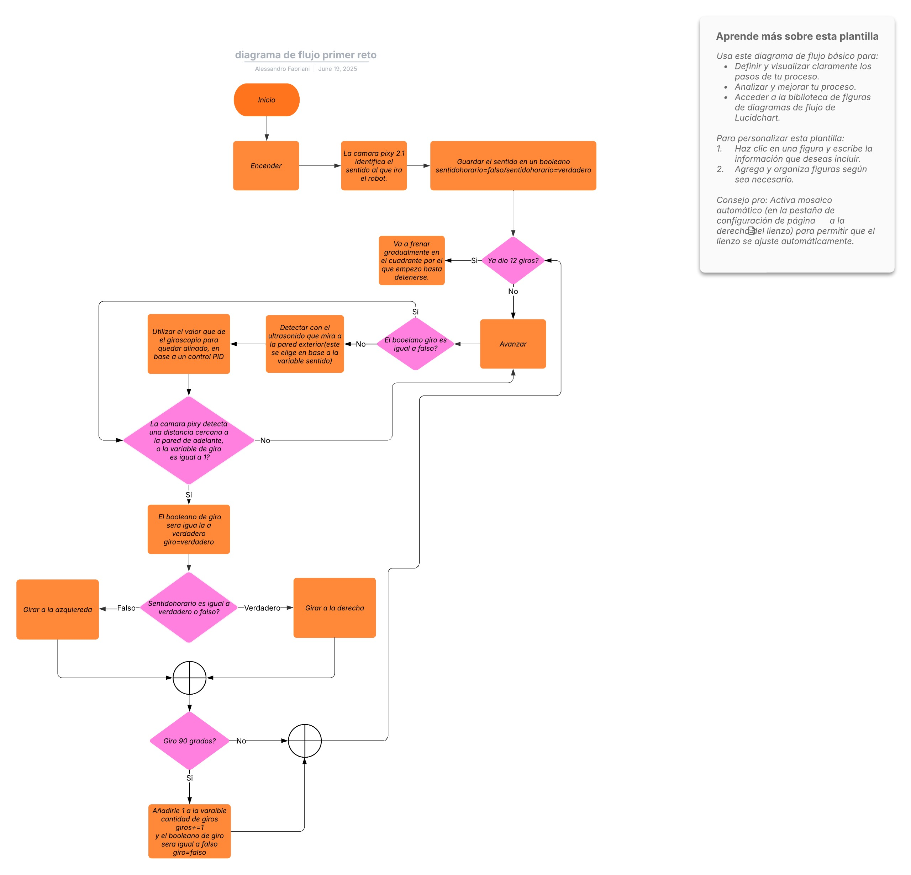
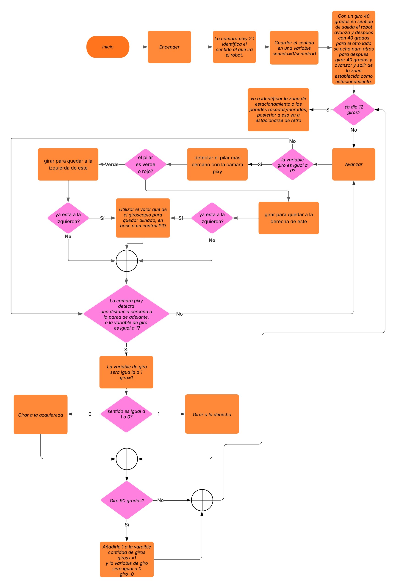

# DON BOSCO ENGINEERS

## Eduardo
Soy estudiante de cuarto año de bachillerato, soy alguien muy sociable, competitivo, y me gusta experimentar en cosas que nunca he hecho. Este es mi primer año en robótica, por lo consiguiente no tengo mucha experiencia en este ámbito. Tengo conocimientos del mundo automotriz, por lo que soy el mecánico y diseñador del robot.
## Alessandro
Soy estudiante de quinto año de bachillerato, me califico como trabajador y competitivo; debo decir que odio perder. Este es mi segundo año en la WRO. El año pasado competí en la categoría Misiones Robóticas, también participe en la competencia de la ONU AI for youth challenge en la cual mi equipo fue el ganador. Tengo experiencia en programación, por lo cual soy el programador 
## Brayan
Soy estudiante de cuarto año de bachillerato, me considero alguien muy sociable, competitivo, creativo y gozo siempre de muy buen humor. Este es mi segundo año en robótica, el año pasado participé en la competencia internacional de la WRO, celebrada Turquía, en la categoría Futuros Innovadores. este año me he planteado un reto: consolidarme como campeón internacional en una categoría distinta; la de Futuros Ingenieros. Por mi experiencia en la electrónica y programación soy, el responsable de todo el cableado en el proyecto y programador.

## EL PROYECTO CHOLA
El equipo DB Engineers se enorgullece en presentar a *Chola*, un robot que representa nuestro esfuerzo de diseño y desarrollo de un sistema autónomo capaz de actuar de manera inteligente con su entorno, que permite demostrar integrar diversas tecnologías de control, para buscar la eficiencia y precisión en cada una de las tareas que debe ejecutar.
Durante el desarrollo de este proyecto, afrontamos desafíos que requirieron idear e implementar soluciones para dar vida a nuestro robot, desde su arquitectura de software y hardware hasta su capacidad para navegar y ejecutar acciones específicas. Chola es más que un robot; es una prueba de nuestro compromiso con la ingeniería y la innovación, creado para superar obstáculos y aprender de su interacción con el mundo.

## EL ROBOT
El sistema de control adoptado para nuestro robot, ha sido desarrollado en el entorno de programación Arduino IDE, utilizando para ello la placa Arduino GIGA como controlador principal, permitiendo una interacción eficiente con el hardware del robot, sustentando su operación autónoma
El núcleo de este sistema se ubica en el archivo src/main_robot_control.ino. Este código está diseñado para gestionar los subsistemas críticos del robot, que incluyen:
- Medición de distancia: Esencial para la navegación y la prevención de que el robot este muy cerca de la pared y pueda alterar su funcionamiento chocándose o alterando su velocidad, para ello usaremos la camara PIXY 2.
- Control preciso del movimiento: Usaremos PID para mantener el robot estable que no se desvié manteniéndose siempre en el medio de la pista, esto hara que no colisione contra la pared, para ello usaremos un giroscopio MPU_9250.
- Detección de líneas de color azul y naranja: Clave para reconocer si el robot está girando en sentido horario o antihorario, e identificar el color de los pilares y la zona de estacionamiento, para lograr esto usaremos una cámara PIXY 2.
La estructura del código se organiza en una serie de funciones clave. Cada una de estas funciones ha sido creada para interactuar de manera directa y específica con los diversos componentes electromecánicos del robot, asegurando una comunicación fluida y un control óptimo sobre cada aspecto de su desempeño.

### Controlador de Movimiento: Motor Paso a Paso 5V
Para controlar el movimiento angular preciso del robot, se ha decidido utilizar un motor paso a paso de 5V en lugar de un servo tradicional. Aunque los servos son excelentes para posicionamientos rápidos, se ha descubierto que un motor paso a paso ofrece una precisión de posicionamiento superior y la capacidad de mantener una posición sin requerir una señal PWM constante. Esto es ideal para su sistema de dirección, que necesita un control muy exacto, como el de un sistema Ackermann. Este tipo de motor es perfecto cuando la estabilidad y la precisión del ángulo son más importantes que la velocidad extrema.
### Especificaciones Clave del 28BYJ-48
 
- Voltaje de Operación: Necesita alimentarlo con 5V DC. Es fundamental asegurarse de que la fuente de alimentación para el controlador del motor paso a paso sea estable a 5V para que funcione perfectamente.
- Ángulo de Paso: Típicamente, el ángulo de paso es de 1.8 a 7.5 grados por paso. Esto es lo que le da la resolución del movimiento; cuanto más pequeño sea el ángulo, mayor será la precisión que puede lograr.
- Corriente por Fase: Esta varía según el modelo, pero es vital que su controlador de motor paso a paso pueda suministrar la corriente adecuada para el torque que necesita.
- Torque (Par): Aunque generalmente tiene menos torque que un servo MG995, el torque de el motor paso a paso de 5V es suficiente para la dirección en su robot.
- Número de Fases: Usualmente son bipolares o unipolares, lo cual influye en cómo lo cablea y qué tipo de controlador necesita.
El motor paso a paso de 5V es ideal para el sistema de dirección Ackermann porque su capacidad de posicionamiento exacto y repetible es clave para manipular los ángulos de las ruedas con mucha efectividad. A diferencia de un servo, puede detenerlo en cualquier paso intermedio, lo que le da un control incremental y muy preciso.

### Posibles Mejoras:
- Motores Paso a Paso con Mayor Torque: Si el robot necesita mover mecanismos más pesados o resistir fuerzas externas mayores en el futuro, se consideraría usar un motor paso a paso con un torque nominal más alto. Esto probablemente implicaría un mayor voltaje de operación o corriente, lo que a su vez requeriría un controlador de motor más robusto.
- Protección contra el Agua y el Polvo: Dependiendo de dónde opere el robot, se beneficiaría mucho usar motores paso a paso sellados o construir carcasas protectoras alrededor de ellos. Esto aumentaría su fiabilidad y vida útil al protegerlos de la humedad y la suciedad.

## Microcontrolador: Arduino GIGA R1 WiFi
En la valida anterior, nos apoyábamos en un ARDUINO UNO para gestionar los diversos componentes del robot. Para esta competencia, buscamos una solución más potente y consolidada, por lo que confiamos en el Arduino GIGA R1 WiFi, que es microcontrolador el cual es un avance significativo, al combinar una gran capacidad de procesamiento con conectividad integrada, que lo hace ideal para manejar todos los sensores y actuadores del robot de manera más optimizada y eficiente.
## Especificaciones Clave del Arduino GIGA R1 WiFi:

- Microcontrolador: STM32H747XI (Dual-core, Cortex-M7 a 480 MHz y Cortex-M4 a 240 MHz)
- Memoria Flash: 2 MB
- SRAM: 1 MB
- Frecuencia del reloj: Hasta 480 MHz (Cortex-M7)
- Pines: 76 pines digitales I/O (incluyendo 12 analógicos, 20 PWM, 4 UART, 3 SPI, 3 I2C, entre otros).
- Voltaje de entrada (VIN): 6-24V
- Capacidades Adicionales: Wi-Fi y Bluetooth integrados, USB-C, conector JTAG.
## Posibles Mejoras:
- Diseño de un PCB personalizado: Crear una placa de circuito impreso (PCB) a medida que integre directamente el Arduino GIGA R1 WiFi con otros componentes esenciales. Esto reduciría el cableado, optimizaría el espacio y ofrecería una configuración más limpia y profesional.

[Aqui lo encontraras](https://www.amazon.com/Arduino-Giga-R1-WiFi-ABX00063/dp/B0BTTRZ9TB)  [text](https://www.amazon.com/Arduino-Giga-R1-WiFi-ABX00063/dp/B0BTTRZ9TB)

## Unidad de Medición Inercial (IMU): MPU-9250
Un aspecto c que ayuda a la navegación del robot es el sensor MPU-9250, que es un IMU de 9 ejes altamente versátil, que integra un acelerómetro de 3 ejes, un giroscopio de 3 ejes y un magnetómetro de 3 ejes en un único chip. 
Aunque el MPU-9250 es capaz de proporcionar datos de aceleración y orientación magnética, actualmente nos enfocamos en utilizar la velocidad angular proporcionada por el giroscopio para calcular el ángulo de orientación del robot. Esta información es esencial para rastrear los giros y obtener en función de eso el ángulo de desviación YAW (ángulo en Z) que representa las deviaciones de lado a lado de forma horizontal, permitiendo al robot comprender su orientación espacial y ajustar su trayectoria.
## Especificaciones Clave del IMU MPU-9250:

    - Rango del Giroscopio: Seleccionable entre ±250, ±500, ±1000, ±2000 °/s
    - Rango del Acelerómetro: Seleccionable entre ±2g, ±4g, ±8g, ±16g
    - Rango del Magnetómetro: ±4800 µT (microtesla)
    - Interfaz de Comunicación: I2C (también soporta SPI)
    - Voltaje de Alimentación: 2.4V a 3.6V (comúnmente se usa con módulos breakout de 3.3V o 5V con regulador)
## Posibles Mejoras:
    - Implementación de Fusión de Sensores (Acelerómetro + Giroscopio + Magnetómetro): Actualmente, solo utilizamos el giroscopio. Una mejora fundamental sería aplicar algoritmos de fusión de sensores (como el filtro de Kalman o el filtro complementario). Al combinar los datos de los tres componentes (acelerómetro, giroscopio y magnetómetro), obtendríamos una estimación mucho más precisa y robusta de la orientación absoluta (cabeceo, alabeo y rumbo) del robot, compensando la deriva del giroscopio y siendo más resistente a las interferencias.
    - Mitigación de Ruido y Vibraciones: Aunque el MPU-9250 es un buen sensor, en entornos con vibraciones significativas del robot, se pueden implementar filtros digitales adicionales en el software (ej., promedios móviles, filtros de paso bajo) para suavizar las lecturas y obtener datos más estables para los cálculos de orientación.

[aqui lo encontraras](https://www.amazon.com/-/es/MPU-9250-MPU9250-Giroscopio-aceleración-llegada/dp/B0DZVC5CG4/ref=sr_1_1?__mk_es_US=ÅMÅŽÕÑ&dib=eyJ2IjoiMSJ9.v2-K_uJllzT5KHT5s_lTDVdParcJ4usfJxIvj8Q8RONAsiDiNizib86p_vkQzXw_S258xHNWHLELeIBfJ2_hlrw7r26-kr8ZsZxv76lkbyQ.g5RCJe4iWob8q1qgMWSCl-Nlf-ys2agpGqLTEbVSZ1o&dib_tag=se&keywords=MPU-9250&qid=1750297365&sr=8-1)

## Construcción Mecánica y Eléctrica
El proyecto Chola basa la estructura de su chasis en un Kit de carros autónomos adquirido a través de Alibaba: Encuéntralo aquí 

[Aquí encontrará un tutorial del armado original del chasis](https://youtu.be/ulTM1uV1Bvg?si=uPVaVt-tIMoJ6x8m)

A pesar de ser un chasis adquirido, este fue sometido a algunas modificaciones con el fin de adaptarlo mejor a las necesidades y los lineamientos de la competencia. Es por ello que decidimos realizar un doblez a la platina principal del chasis en 90 grados hacia arriba:

----

El kit incluye otras piezas de plástico que fueron usadas de manera particular para este proyecto, específicamente las siguientes piezas:

Estas deberán unirse de la siguiente manera: Haciendo uso de resina epoxica mantenemos las piezas unidas de manera firme y resistente a impactos durante las pruebas de funcionamiento. También aprovechamos los agujeros para tornillos que tienen estas piezas para fijar nuestro microcontrolador principal:
[Insertar imagen del microcontrolador fijado aquí]

## Sistema de Dirección
El kit original venía con un sistema de dirección basado en un servomotor y algunas piezas para crear un sistema de dirección Ackerman. Este diseño fue una elección conveniente, no solo porque ya estaba incluido en el kit, sino también porque la configuración Ackerman es ideal para el propósito de la competencia. Permite que el vehículo tenga un sobreviraje controlado, lo que facilita giros más rápidos y eficientes, optimizando así el rendimiento en la competencia.

Imágenes de las piezas: 

### Sin embargo, a pesar de las ventajas del sistema ya incluido con el kit, por motivos de precisión y durabilidad, decidimos realizar cambios a este sistema:
- Crear una placa de Baquelita de 2.5cm por 8.5cm.
- Utilizar un motor tipo stepper 28BYJ-48 de 5v.
- Utilizar una cobertura de motor circular.
- Perforar la cobertura para el motor.

Si se hicieron todos los pasos de manera correcta este sera el resultado:

## Medidas generales

Las ruedas traseras vienen incluidas en el kit , tienen unas medidas de 6cm de diámetro y 3cm de grosor 

Las ruedas delanteras son ruedas de para lego genéricas con medidas de 2.5cm de grosor y 4 cm de diámetro.

El eje trasero mide 8.5cm de longitud y el eje delantero mide 6.4cm con un volado delantero de 5cm.

La distancia entre ejes de 15.5 cm 

 - Las medidas totales de Chola con 21cm de largo y 8cm de ancho sin tomar en cuenta las ruedas , con estas el groso se eleva a 15 cm 
## Sistema de motor
 - El motor usado es un motor DC de 3v a 12v genérico , con un piñón de 12 dientes. 
Para transmitir el movimiento a las ruedas traseras , se engrana el motor a un piñón de 45 dientes , este último está ubicado en el eje de las ruedas y transmite el movimiento de los motores en una relación de 3,75

- Lo cual todo esto nos deja una transmisión de 1500rpm a 375 rpm de el motor a el eje.

## Circuito electrico

Este diagrama representa las conexiones fundamentales del sistema de nuestro robot “Chola”, propulsado por una batería de Li-on de 7.4V y 4000 mAh y gestionado por un Arduino GIGA. Esta integración de componentes permite la detección de obstáculos, el control de movimiento y la percepción visual.
La batería de 7.4V y 4Ah sirve como la fuente de energía principal para todo el sistema. Ya que muchos componentes operan a 5V o 3.3V, se ha incorporado un regulador de voltaje LM2596. Este regulador es muy importante, ya que reduce el voltaje de la batería (7.4V) a 5V para alimentar el Arduino GIGA y los sensores, minimizando la disipación de calor en comparación con los reguladores lineales. El motor DC se alimenta directamente de la batería a 7.4V, aprovechando la capacidad de la batería para proporcionar la corriente necesaria para su funcionamiento. 

- Tipo de Batería: Ión de Litio (Li-ion). Fueron elegidas por su equilibrio entre densidad de energía, ciclo de vida y seguridad relativa, en comparación con otras baterías de litio. 
- Voltaje Nominal: 7.4V. Esto se debe a que está compuesto por dos celdas de Ión de Litio conectadas en serie (2S). Cada celda Li-ion tiene un voltaje nominal de 3.7V, lo que suma 2×3.7V=7.4V. 
- Capacidad: 4000 mAh (Miliamperios-hora) o 4 Ah (Amperios-hora). Esta cifra indica cuánta carga eléctrica puede almacenar la batería. Teóricamente, una batería de 4Ah puede suministrar 4 Amperios de corriente durante una hora, o 1 Amperio durante cuatro horas. 
- Dimensiones y Peso:3.7cm x 1.8cm x 7 cm y 100 gramos de peso.

## Estrategia

### Primer reto:
empieza cuando pulsamos el botón, aquí la cámara pixy 2.1 va a leer la línea que tiene al frente, si lee al principio la línea azul  seleccionará mediante una variable que determinará el programa antihorario, mientras que si lee al principio la línea naranja que está más cerca, se determinará mediante la misma variable el programa horario, todo esto mientras el robot va avanzando, cuando detecta que va muy cerca a la pared va a girar hacia la derecha o izquierda dependiendo de lo que haya detectado primero o si la línea izquierda o derecha la cámara pixi 2.

A su vez, para mantenerse mirando al frente usará el giroscopio, cuando gire, va a girar a hasta noventa grados, y cuando avance va a tomar en cuenta el valor del giroscopio y en cada cuadrante se va a actualizar el cero ya que cuando gira el valor del giroscopio te puede arrojar un valor como 0 grados, 90 grados, 180 grados, eso se va a solucionar con una función, usará un control pid para que siempre mire para al frente.

Va a tener un contador de giros mediante una variable, y cuando identifique que ya ha dado 12 vueltas, procederá a detenerse.

### Segundo reto:
empieza cuando pulsamos el botón, aquí la cámara pixy 2.1 va a leer la línea que tiene al frente, si lee al principio la línea azul  seleccionará mediante una variable que determinará el programa antihorario, mientras que si lee al principio la línea naranja que está más cerca, se determinará mediante la misma variable el programa horario, todo esto mientras el robot va avanzando, cuando detecta que va muy cerca a la pared va a girar hacia la derecha o izquierda dependiendo de lo que haya detectado primero o si la línea izquierda o derecha la cámara pixi 2

Para poder esquivar los pilares rojos y verdes correctamente, la cámara pixy 2.1 va a detectar los pilares rojos y verdes, en base a eso, va a girar a la izquierda del pilar verde y a la derecha del pilar rojo en el caso horario, pero en el antihorario cuando detecte un pilar verde ira lo esquivara por el lado derecho y el pilar rojo por el lado izquierdo.

Va a tener un contador de giros mediante una variable, y cuando identifique que ya ha dado 12 vueltas, va a buscar las paredes rosadas/moradas, cuando las identifique con la cámara pixy 2.1, procederá a estacionarse en paralelo en el estacionamiento retrocediendo, ajustando el giro varias veces para que vaya entrando  y acomodándose para quedar estacionado.

## Imagenes del robot

Foto frontal:
Foto izquierda:
Foto drecha:
Foto atras:
Foto arriba:
Foto abajo:

