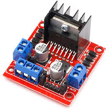
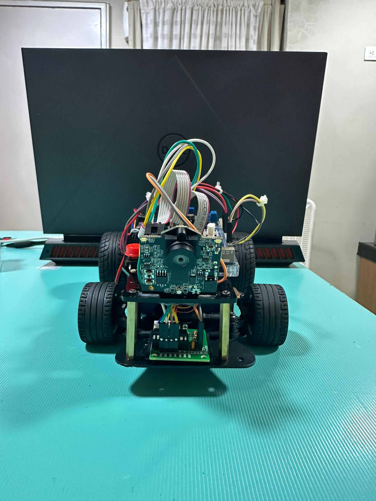
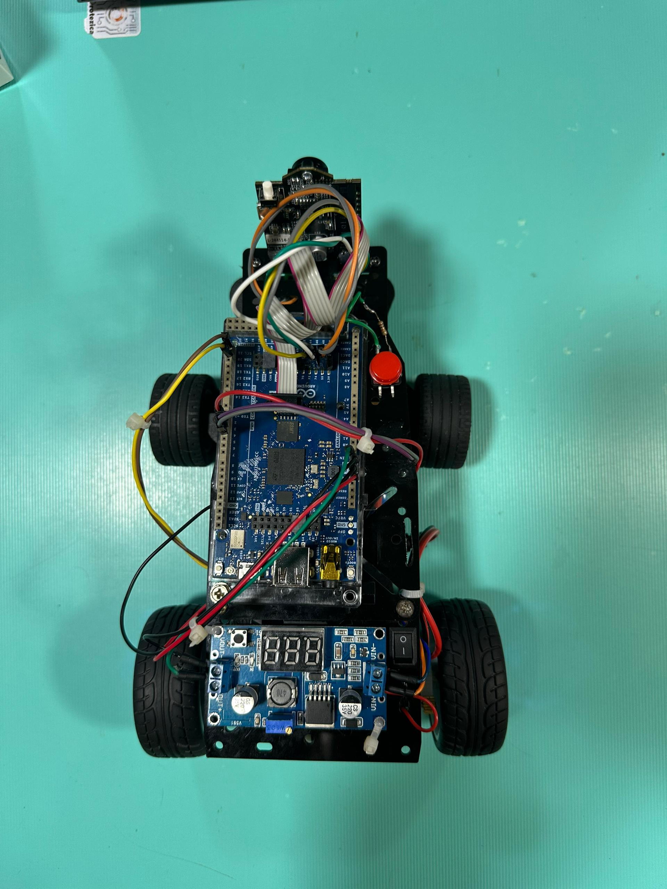

# DON_BOSCO_ENGINEERS
## Team Members:
* Brayan Tamiche 
* Eduardo Aguilera
* Alessandro Fabriani

## Content (Preliminar)

* **`t-photos/`**: Contains 2 photos of the team (an official one and one funny photo with all team members).
* **`v-photos/`**: Contains 6 photos of the vehicle (from every side, from top and bottom).
* **`video/`**: Contains the `video.md` file with the link to a video where driving demonstration exists.
* **`schemes/`**: Contains one or several schematic diagrams in form of JPEG, PNG or PDF of the electromechanical components illustrating all the elements (electronic components and motors) used in the vehicle and how they connect to each other.
* **`src/`**: Contains code of control software for all components which were programmed to participate in the competition.
* **`models/`**: Is for the files for models used by 3D printers, laser cutting machines and CNC machines to produce the vehicle elements. If there is nothing to add to this location, the directory can be removed.
* **`other/`**: Is for other files which can be used to understand how to prepare the vehicle for the competition. It may include documentation how to connect to a SBC/SBM and upload files there, datasets, hardware specifications, communication protocols descriptions etc. If there is nothing to add to this location, the directory can be removed.

## Introduction

Nuestro software de control para el vehículo autónomo está desarrollado en el entorno de Arduino IDE, utilizando la placa **Arduino UNO** como controlador principal. El código, ubicado en `src/main_robot_control.ino`, está diseñado para gestionar los principales subsistemas del robot: sensado de distancia, control de motores y detección básica de línea/color.

El código se estructura en varias funciones clave que se relacionan directamente con los componentes electromecánicos.

---

### Componentes Electromecánicos y su Relación con el Código

#### Placa Controladora Principal: Arduino UNO

* La placa **Arduino UNO** es el cerebro que procesa todas las lecturas de los sensores y envía las señales de control a los actuadores (motores y servomotor). Es la base de nuestro sistema embebido.
* **Especificaciones clave:** Microcontrolador ATmega328P, 14 pines digitales (6 con PWM), 6 pines analógicos, 16 MHz de reloj.
* **Función en el robot:** Ejecuta el algoritmo de navegación, procesa datos de sensores y controla el movimiento.
* **Conexión al código:** El `setup()` y `loop()` principales se ejecutan en el Arduino UNO.

#### Controlador de Motor: L298N

* El módulo **L298N** es un driver de motor de doble puente H, que nos permite controlar la dirección y la velocidad de dos motores DC de forma independiente o un motor paso a paso.
* **Especificaciones clave:** Voltaje de operación de 5V a 35V, corriente de hasta 2A por canal.
* **Función en el robot:** Traduce las señales de control de baja corriente del Arduino en señales de alta corriente para los motores de propulsión del vehículo.
* **Conexión al código:** Se controla mediante pines digitales (IN1, IN2 para dirección) y un pin PWM (ENA para velocidad) del Arduino, como se ve en el código `main_robot_control.ino`.

#### Motores DC de Propulsión

* Utilizamos **motores DC** de tipo genérico, que son la fuerza motriz del vehículo.
* **Especificaciones clave:** Operan en un rango de voltaje de **3V a 12V**. Esto nos permite flexibilidad en la elección de la fuente de alimentación y en el ajuste de la velocidad mediante PWM.
* **Función en el robot:** Proporcionan la tracción para mover el vehículo hacia adelante y hacia atrás.
* **Conexión al código:** Controlados a través del módulo L298N, sus velocidades se regulan mediante la función `acelerar_desacelerar()` y la dirección con `avanzar()` en `main_robot_control.ino`.
(./schemes/dc_motor.jpg)

#### Servomotor de Dirección: MG99R

* El **Servomotor MG995R** es un servomotor de alto torque (13kg-cm a 6V) que se utiliza para la dirección del vehículo.
* **Especificaciones clave:** Opera con un voltaje de 4.8V a 6.6V, ángulo de rotación de aproximadamente 180 grados. Es un servo analógico con engranajes metálicos.
* **Función en el robot:** Permite un control preciso del ángulo de las ruedas delanteras (o del mecanismo de dirección) para guiar el coche.
* **Conexión al código:** Aunque no está explícitamente detallado en el fragmento de código actual, el control de este servomotor se realizaría utilizando la librería `Servo.h` de Arduino y un pin PWM. Su integración es clave para la lógica de giro avanzada y la navegación precisa.
(./schemes/servomotor.jpg)

#### Sensores Ultrasónicos (Distancia)

* Utilizamos tres **sensores ultrasónicos (HC-SR04 o similar)**: frontal, izquierdo y derecho.
* **Especificaciones clave:** Rango de detección de 2cm a 400cm, precisión de 3mm.
* **Función en el robot:** Detectar obstáculos y medir distancias al entorno para evitar colisiones y asistir en la navegación.
* **Conexión al código:** Se interactúa con ellos utilizando la librería `NewPing.h`. La función `medir_distancia(int sensor_index)` se encarga de leer y retornar la distancia en centímetros de cada sensor.

#### Sensor Color (Detección de Línea/Color)

* Un **sensor Sensor de color RGB** se utiliza para detectar diferencias en el color de la superficie.
* **Especificaciones clave:** Depende del modelo específico, pero típicamente un modulo con un fotoreceptor con comunicacion I2c.
* **Función en el robot:** Capaz de distinguir Colores basandose en valores RGB
* **Conexión al código:** La función `get_color()` lee el valor que se envia el sensor , proporcionando un valor que varía según la reflectividad de la superficie.

#### Sensor IMU (Pendiente de Integración Completa): MPU6050

* El **sensor MPU6050** es una Unidad de Medición Inercial (IMU) que combina un acelerómetro de 3 ejes y un giroscopio de 3 ejes.
* **Especificaciones clave:** Interfaz I2C, mediciones de aceleración, velocidad angular y temperatura.
* **Función en el robot:** Proporciona datos de orientación y movimiento para mejorar la precisión en la navegación, la detección de giros y el control de estabilidad. Aunque el componente está considerado, su integración completa en la lógica de giro y control avanzado aún está pendiente de desarrollo en el fragmento de código actual.
* **Conexión al código:** Se comunica a través de la interfaz I2C con el Arduino UNO.

---

### Proceso para Construir/Compilar/Subir el Código:

Para utilizar este código en el vehículo, sigue los pasos estándar del Arduino IDE:
1.  **Instalación de Librerías:** Asegúrate de tener instalada la librería `NewPing` (y `Servo.h` si se va a controlar el servomotor) en tu Arduino IDE. Puedes hacerlo desde el Gestor de Librerías (`Sketch > Include Library > Manage Libraries...`).
2.  **Abrir el Sketch:** Abre el archivo `main_robot_control.ino` (o como lo hayas nombrado) en el Arduino IDE.
3.  **Configuración de Placa y Puerto:** En el Arduino IDE, selecciona la placa "Arduino UNO" en `Tools > Board` y el puerto COM/Serial correcto al que esté conectado tu Arduino en `Tools > Port`.
4.  **Compilar:** Haz clic en el botón "Verify" (verificar) para compilar el código y comprobar errores de sintaxis.
5.  **Subir:** Haz clic en el botón "Upload" (subir) para cargar el programa compilado a la placa Arduino UNO conectada.

## Galería del Vehículo

Aquí se muestran diferentes vistas de nuestro robot.

### Vista Frontal

### Vista Superior

### Vista de Perfil

### Vista Trasera

### Vista Inferior 

### Otra Vista Lateral 
